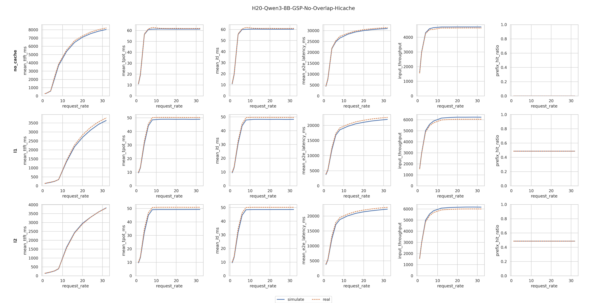
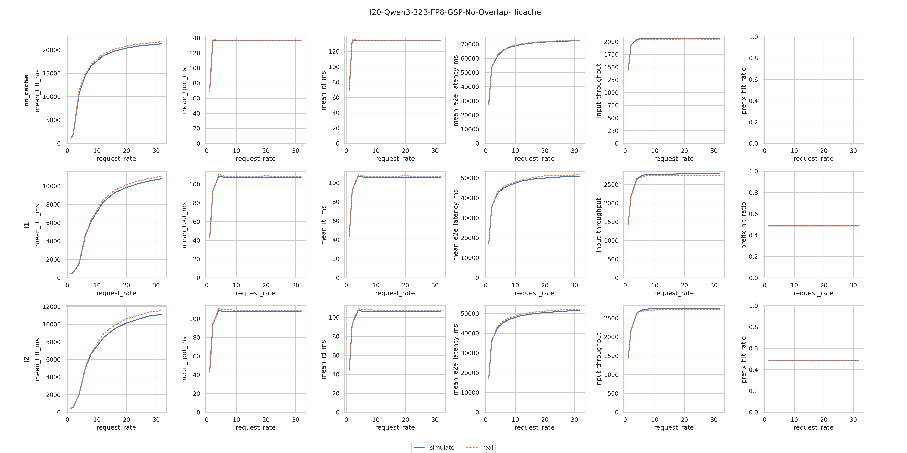

# Hisim
---
[English Version](README.md)

---
## Background
在大语言模型（LLM）推理服务快速落地与规模化部署的背景下，推理性能直接影响用户体验、服务成本与资源效率。首 Token 延迟（TTFT）、每输出 Token 延迟（TPOT）和系统吞吐量等关键指标，高度依赖于模型结构、硬件平台（如 A100/H100）、推理引擎（如 SGLang、vLLM、TensorRT-LLM）及其运行时配置（量化、批处理、并行策略等）的复杂耦合。

传统基于真实 GPU 集群的端到端压测成本高、周期长，难以高效探索海量配置组合。为此，我们提出一种基于 CPU 的高性能模拟系统 Tair-KVCache Hisim：通过回放生产环境或代表性场景的真实推理 Workload Trace，在通用 CPU 平台上快速、低成本、高保真地预测不同模型、目标硬件、推理引擎及配置下的关键性能指标，支撑推理系统的高效设计与优化。

---
## Introduction

Hisim 仿真工具 通过提供与sglang服务一致的命令行接口, 启动仿真服务，用户可以通过打流脚本，向该服务发起用户请求重放数据集压测/普通压测，Hisim提供与sglang bench_serving相同的数据指标。使用示例详见 Quick Start。

---
## Installation

```bash
cd hisim
pip install .
```

---
## Support Matrix

* **Inference Engine**: SGLang v0.5.6.post2  
* **Models**: Qwen3-32B-FP8, Qwen3-8B  
* **GPU**: H20-96GB  

---
## Quick Start

### Step 1 (Optional): 请求重放模式：准备真实的请求数据集

* 如果已经有一份自己采集好的数据集，请按照我们的格式做一下转换，即可使用，跳转到下一步骤，格式如下
  ```json
  {"rid": "21e5xx", "timestamp":732.31, "output_length": 1024, "input_length": 1024, "input_ids": [925, 3911, ...], "output_ids": [244, 129, ...], "queue_end": 7522.4524386, "final_prefix_cache_len": 0}
  {"rid": "21e6xx", "timestamp":736.39, "output_length": 512, "input_length": 256, "input_ids": [192, 9171, ...], "output_ids": [254, 149, ...], "queue_end": 7523.4524386, "final_prefix_cache_len": 0}
  {"rid": "21e7xx", "timestamp":739.35, "output_length": 20, "input_length": 100, "input_ids": [92, 911, ...], "output_ids": [24, 19, ...], "queue_end": 7524.4524386, "final_prefix_cache_len": 10}
  ...
  ```

* 如果没有准备好请求数据集，本工具提供数据集采集功能，详情参考[README](benchmark/collection/README.md)获取请求数据集

---

### Step 2: Mock Simulation

* 该示例基于采集的实际数据流进行推理仿真压测，您也可以参考[随机数据集仿真](#命令行)进行仿真压测。

#### 劫持仿真服务端拉起

请在项目根目录（即包含本 `README.md` 的目录）中运行以下命令
``` bash
python3 -m hisim.simulation.sglang.launch_server \
  --model-path "Qwen/Qwen3-32B-FP8" \
  --sim-config-path test/assets/mock/config.json \
  --skip-server-warmup
```

> **Notes**:
> - 详细参数参考[详细参数与环境变量设置说明](#mock-simulation推理仿真)。
> - 命令行参数中，`sim` 开头的参数为仿真参数，其他参数为服务框架（SGLang）的参数，通过指定 `--sim-config-path` 设置仿真配置，仿真过程中，只能接受特定的请求，因此需要 `--skip-server-warmup` 避免出现异常。
> - 如果在纯CPU仿真环境中，可能需要安装vllm(sglang cpu版本依赖)，同时需要指定环境变量
>   ``` bash
>   export SGLANG_USE_CPU_ENGINE=1
>   export FLASHINFER_DISABLE_VERSION_CHECK=1
>   ``` 
> - 本样例中提供的[config文件](test/assets/mock/config.json)为测试使用，您可以根据实际情况更改其中的硬件带宽等关键参数使其与step1的采集场景对齐，以保证仿真的准确率；如果您使用了hisim提供的实采数据集，可以配置为该数据集对应的config文件。配置文件的说明请参考[详细文档](#配置文件格式hisim_config_path)。

#### 劫持仿真压测

压测时需要指定 `--bench-mode simulation`，同时不支持 `--warmup-request`。新建终端作为发送端，运行以下命令

- **基于用户数据集重放**
``` bash
python3 -m hisim.simulation.bench_serving \
    --warmup-request 0 \
    --bench-mode simulation \
    --model "Qwen/Qwen3-32B-FP8" \
    --backend sglang \
    --dataset-name hisim-collection \
    --dataset-path user_replay_requests.jsonl
```
- **基于随机构造的特征数据集压测**:
``` bash
python3 -m hisim.simulation.bench_serving \
    --warmup-requests 0 \
    --model "Qwen/Qwen3-32B-FP8" \
    --bench-mode simulation \
    --dataset-name random \
    --request-rate 4 \
    --random-input-len 1024 \
    --random-output-len 1024 \
    --random-range-ratio 1 \
    --num-prompts 50
```

至此,已经完成了基于框架劫持的推理仿真。


**结果示例**
``` bash
============ Serving Benchmark Result ============
Benchmark Mode:                          simulation
Backend:                                 sglang    
Traffic request rate:                    inf       
Max request concurrency:                 not set   
Successful requests:                     50        
Benchmark duration (s):                  20.36     
Elapsed time (s):                        4.40      
Total input tokens:                      51513     
Total input text tokens:                 -1        
Total input vision tokens:               -1        
Total generated tokens:                  51200     
Total generated tokens (retokenized):    -1        
Request throughput (req/s):              2.46      
Input token throughput (tok/s):          2530.02   
Output token throughput (tok/s):         2514.64   
Peak output token throughput (tok/s):    -1.00     
Peak concurrent requests:                -1        
Total token throughput (tok/s):          5044.66   
Concurrency:                             -1.00     
----------------End-to-End Latency----------------
Mean E2E Latency (ms):                   9509.61   
Median E2E Latency (ms):                 9572.55   
---------------Time to First Token----------------
Mean TTFT (ms):                          10.97     
Median TTFT (ms):                        11.08     
P99 TTFT (ms):                           16.71     
-----Time per Output Token (excl. 1st token)------
Mean TPOT (ms):                          9.29      
Median TPOT (ms):                        9.35      
P99 TPOT (ms):                           9.74      
---------------Inter-Token Latency----------------
Mean ITL (ms):                           9.29      
Median ITL (ms):                         9.27      
P95 ITL (ms):                            10.31     
P99 ITL (ms):                            16.47     
Max ITL (ms):                            21.47     
==================================================
``` 

> 压测结果兼容原有的数据，其中 `-1` 表示当前字段不支持。
---

## Usage

### Mock Simulation（推理仿真）

该功能通过“动态劫持”的方式拦截框架的执行流，避免真实的LLM模型推理，当前支持 `SGLang@0.5.6.post2`。
- 支持的参数请参考 
  ```bash
  python -m hisim.simulation.sglang.launch_server --help
  ```

---

### 配置文件格式（`HISIM_CONFIG_PATH`）

配置文件为 JSON，包含三个部分：

- `platform`：硬件与带宽配置  
  - `accelerator.name`：GPU 型号（如 `H20`）
  - `disk_*_bandwidth_gb`：L3 层数据读写带宽（GB/s）
  - `memory_*_bandwidth_gb`：L2 层数据读写带宽（GB/s）

- `predictor`：执行时间预测器（TimePredictor）  
  - `name`：预测器类型，可选 `aiconfigurator` / `schedule_replay`
  - 详细见下方 **TimePredictor** 章节（对应 Worker TimePredictor）

- `scheduler`：并行/数据类型/后端信息  
   > ⚠️ **注意**: 为了简化仿真流程，启动推理服务时**无需**设置多卡并行；并行方式（TP/EP）通过该配置指定，并由预测器模拟并行时间。
  - 当 `predictor.name=aiconfigurator` 时，需额外提供 `backend_version`。

**示例**:
```json
{
  "platform": {
    "accelerator": { "name": "H20" },
    "disk_read_bandwidth_gb": 4,
    "disk_write_bandwidth_gb": 4,
    "memory_read_bandwidth_gb": 64,
    "memory_write_bandwidth_gb": 64
  },
  "predictor": {
    "name": "aiconfigurator",
    "database_path": "path/to/aiconfigurator/data",
    "device_name": "h20_sxm",
    "prefill_scale_factor": 1.02040816,
    "decode_scale_factor": 1.01010101
  },
  "scheduler": {
    "tp_size": 1,
    "ep_size": 1,
    "data_type": "FP16",
    "kv_cache_data_type": "FP16",
    "backend_name": "sglang",
    "backend_version": "0.5.6.post2"
  }
}
```

---

## TimePredictor

### AIConfigurator

- 项目：<https://github.com/ai-dynamo/aiconfigurator>
- 字段说明：
  - `database_path`：自定义算子数据路径（可选）
  - `device_name`：AIConfigurator 内部定义的设备/系统名称
  - `prefill_scale_factor` / `decode_scale_factor`：可选缩放系数，用于校准预测时间

示例：

```json
{
  "name": "aiconfigurator",
  "database_path": "path/to/aiconfigurator/data",
  "device_name": "h20_sxm",
  "prefill_scale_factor": 1.02040816,
  "decode_scale_factor": 1.01010101
}
```

---

## Examples

### Qwen3 Models

**Configuration**

在`hisim/test/assets/mock`目录中，我们提供了在H20上运行Qwen3-8B和Qwen3-32B-FP8的仿真配置文件: 
- `config.qwen8b.aic.json`  
- `config.qwen32b.aic.json`

其中**aiconfigurator** 的硬件配置信息和算子插值数据包可以从[LatencyPrism/hisim](https://github.com/kunluninsight/LatencyPrism/tree/hisim) 的`Hisim`目录获取，将 `H20_AIC.zip`解压至 `download_path`，即可使用上述配置文件进行仿真

**Accuracy**

我们针对上述两个模型在不同请求速率下进行了三种kvcache命中场景的仿真，各指标预测误差均在**5%**以下

***Qwen3-8B***



| Predictor        | Case         | Mean TTFT | Mean TPOT | Mean ITL | Input Throughput | Duration | Prefix Hit Ratio |
|:---------------:|:---------:|:-----:|:-----:|:-----:|:----------------:|:--------:|:----------:|
| aiconfigurator   | no_cache  | 3.42%         | 1.64%         | 1.78%        | 1.41%                | 1.39%        | 0.0%                 |
| aiconfigurator   | L1       | 4.15%         | 3.47%         | 3.54%        | 2.4%                 | 2.33%        | 0.04%                |
| aiconfigurator   | L2         | 2.38%         | 4.05%         | 4.07%        | 2.35%                | 2.29%        | 0.0%                 |

***Qwen3-32B-FP8***


| Predictor        | Case         | Mean TTFT | Mean TPOT | Mean ITL | Input Throughput | Duration | Prefix Hit Ratio |
|:---------------:|:---------:|:-----:|:-----:|:-----:|:----------------:|:--------:|:----------:|
| aiconfigurator  | no_cache  | 2.77% | 0.58% | 0.52% | 0.52%    | 0.51%  | 0.00%  |
| aiconfigurator  | L1    | 2.40% | 1.03% | 1.02% | 1.04%    | 1.03%  | 0.04%  |
| aiconfigurator  | L2    | 3.05% | 1.11% | 1.02% | 1.13%    | 1.12%  | 0.00%  |

**Case Definitions**:  
- `no_cache`: 没有缓存命中
- `L1`: 仅GPU的HBM命中 
- `L2`: 同时在GPU HBM和host DRAM命中

**误差统计**: 
采用平均绝对百分比误差**MAPE**，Mean Absolute Percentage Error
